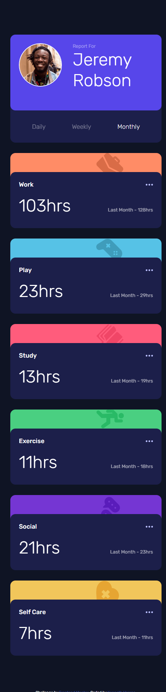

# Frontend Mentor - Time tracking dashboard solution

Just some quick challenge to refresh grid and flexbox concepts.
This is a solution to the [Time tracking dashboard challenge on Frontend Mentor](https://www.frontendmentor.io/challenges/time-tracking-dashboard-UIQ7167Jw). Frontend Mentor challenges help you improve your coding skills by building realistic projects. 

## Table of contents

- [Overview](#overview)
  - [The challenge](#the-challenge)
  - [Screenshot](#screenshot)
  - [Links](#links)
  - [Useful resources](#useful-resources)

## Overview

### The challenge

Users should be able to:

- View the optimal layout for the site depending on their device's screen size
- See hover states for all interactive elements on the page
- Switch between viewing Daily, Weekly, and Monthly stats

### Screenshot

### Links

- [Solution URL](https://www.frontendmentor.io/solutions/desktop-and-mobile-friendly-time-tracking-dashboard-html-css-and-js-y2LyI26Yg8)
- [Live Site URL](https://tenick.github.io/time-tracking-dashboard-main/)

### Useful resources

- [Traversy Media - Grid Crash Course](https://www.youtube.com/watch?v=0xMQfnTU6oo)
- [Traversy Media - Flexbox Crash Course](https://www.youtube.com/watch?v=3YW65K6LcIA&t=1772s)
